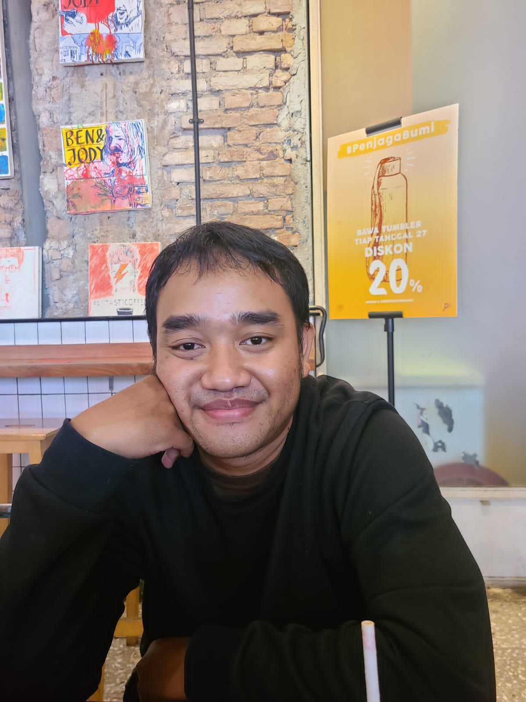

# About Me

### Hi, I'm [Esis Ramadhan](https://github.com/esisram) 👋



## Authors

- [@esisram](https://www.github.com/esisram) -> Software Engineer Documentations
- [@esis21marta](https://www.github.com/esis21marta) -> Data Scientist Documentations

Hello, I am Esis Ramadhan, currently, I am working as a Senior Data Scientist. I have been working on this roles since 2018, It was started at OVO (Financial Technology company which provides e-payment). and then I moved to Telkomsel (Telecomunication company) as a Officer Internal CDP-Project Data Scientist. I have a strong background in data science, machine learning, and statistics. I have experience in developing predictive models, data visualization, and data storytelling. I am also skilled in programming languages such as Python, R, and SQL.

## 🔗 Links

[](https://www.linkedin.com/in/esisramadhan/)
<a href="https://www.github.com/esisram" target="_blank">

</a>

## 🛠 Skills

Javascript, HTML, CSS...

## Modul 1 : week 0 - week 2

### Deliverables

Build the foundational HTML structure for your responsive website.

### Task

Create the HTML structure for your responsive website. Focus on the following components:

1. Page Structure and Semantics:

- Implement the basic structure of your web page using HTML tags.
- Ensure the use of correct semantics for each HTML element.

2. Content:

- Add relevant content to your website. This could be information about your chosen topic or placeholders if the content is not finalized yet.

3. Form Set:
   Create a form set that includes:

- Input type text
- Textarea
- Submit button
- One of the radio buttons, checkboxes, and select

4. Create readme.md in repository and describe what you will build, this include

- heading
- paragraph
- image

```
Example Website: https://my-favorite-bakery.netlify.app/
Example Readme: https://github.com/revou-fsse-3/module-1-alvidofaisal
```

readme.so
